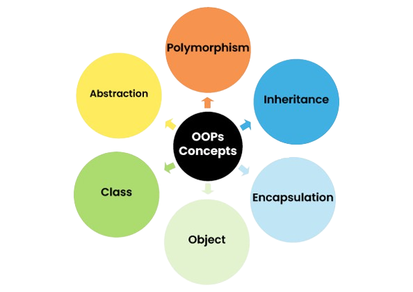

# OOPS




## Contents
### 1. Classes & Objects
### 2. Methods


## Classes & Objects

### CLASSES

Classes are blueprint from ehich individual objects are created. each class has its own attribute and method and can be accessed through objects

#### PROPERTIES 
* Classes doesn't take any byte if memory 
* A class is just like real life entity but it is not real world entity. Its a blue print where we can specify the functionalities 
* Class contain method and data members (attributes).
* A class can also be a nested class
* a class follow all the rules of OOPS ie.. inheritence, polymorphism, encapsulation, etc..
#### Types of Classes 
* Local Variable- defined inside the methods, constructors, or blocks are called Instance Variable
* Instance Variable- Variable which are declared within the class but outside any method. It can be accessed from inside any method, constructors or block perticular class.

* Class Variable- Variable which are declared inside the class outside any method with static keyword.

<b>Example ~</b>
```java
class Person {
    // Declaring attributes. 
    String name;  
    int age;  
}
```
#### OBJECTS

Objects is a variable od type class. It is the basic concept of OOPs. A class has method & attributes this method & attribute are accessedthrough an object.<b>Thus Object is an Instance of a class</b> 

<b>Example ~</b>
```java
class firstOops{
    public static void main(String[] args)
    {
        Person p1 = new Person();
        p1.age=21;
        p1.name="Himanshu";
        System.out.println(p1.age+" "+p1.name);
    }
}
```

### Java Class Attributes.

Java class attributes are the variables that are bound in a class i.e., the variables which are used to define a class are class attributes. 

### Java Class Methods.

Class methods declaration is similar to the user-defined methods declaration except that class methods are declared within a class.

```java
class firstOops {
    public static void main(String[] args) {
        Person p1 = new Person();  // Creating an object of type Person
        p1.age = 21;  // Assigning a value to the age attribute of p1
        p1.name = "Himanshu";  // Assigning a value to the name attribute of p1
        
        System.out.println(p1.age + " " + p1.name);  // Printing age and name of p1
        p1.eat();  // Calling the eat() method on p1
        p1.sleep();  // Calling the sleep() method on p1
        P1.Walk();  //THIS IS KNOWN AS COMPILE TIME POLYMORPHISM AND IS POSSIBLE THROUGH METHOD OVERLOADING
        p1.walk(2);  // Calling the walk() method on p1 with a parameter
    }
}

class Person {
    String name;  // Declaring a String attribute name
    int age;  // Declaring an integer attribute age
    
    void sleep() {  // Defining a method sleep() with no parameters
        System.out.println(name + " is Sleeping");  // Printing the name attribute with a message
    }
    
    void eat() {  // Defining a method eat() with no parameters
        System.out.println(name + " is eating");  // Printing the name attribute with a message
    }
    
    void walk() {
        System.out.println(name + " is walking");  // Printing the name attribute and steps without parameter
    }

    void walk(int steps) {  // Defining a method walk() with an integer parameter steps
        System.out.println(name + " has walked " + steps + "Km");  // Printing the name attribute and steps parameter with a message
    }
}

```
Output

```Output
21 Himanshu
Himanshu is eating
Himanshu is Sleeping
Himanshu is walking //this is known as compile time polymorphism and is possible through method overloading.
Himanshu has walked 2 Km
```
## POLYMORPHISM

* POLYMORPHISM is made up of two words POLY+MORPHISM means multiple forms 

* It is the ability of an object to take on many forms.

* It is an important feature of Java OOPS concept and allows us to perform multiple operations  by using single name of any method.

